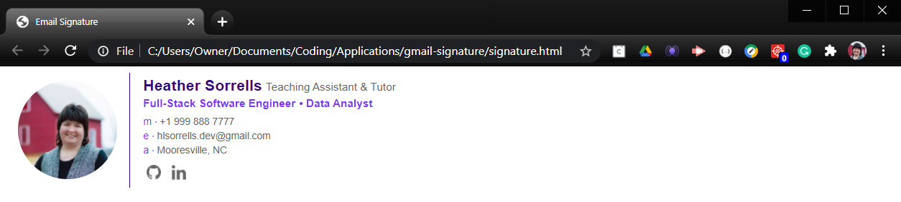
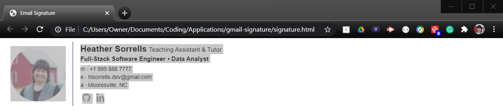
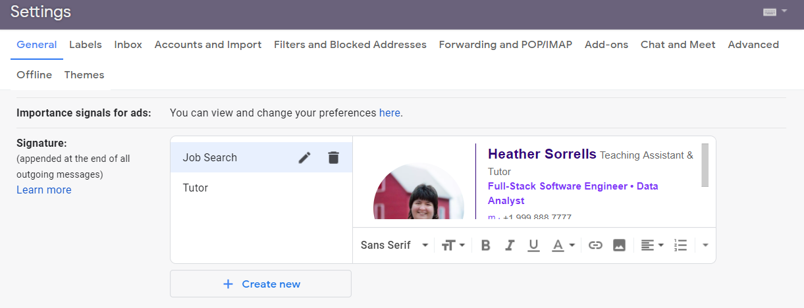
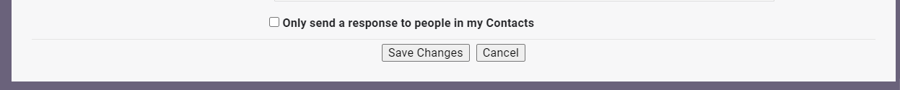
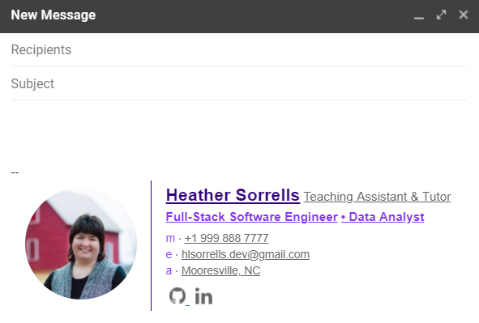

# Gmail Signature 

Having a nice looking signature in your email will always make it more professional and put an impression that you care about things :+1:

## Original Repo
Credit for this repository goes to the original developer, Sk Arif (https://github.com/skarif2). You can find the original repo here (https://github.com/skarif2/gmail-signature). Believe me, you should definitely check out this developer's repos!

## Original Email Signature
This is the image of the original repo's email signature. I love the cat pic!
<div align="center">
  
</div>

<br />
<br />

## My Personalized Email Signature
I made a few slight changes to my personal email signature. First I customized my colors to match the new portfolio website that I am building. Second, I decided to omit my employer name and just list my current position next to my name. Then I listed the job titles of careers that relate to my experience and training.

<div align="center">
  
</div>

## How to use this repo

- Clone the original repo
```sh
$ git clone git@github.com:skarif2/gmail-signature.git
```
- Or you can also clone my repo
```sh
$ git clone git@github.com:hlsorrells/gmail-signature.git
```

- Open the directory

- Open `signature.html` in any browser 

- Modify `signature.html` to your liking (additional social media links are commented out in my file)

- Select everything on the screen and copy it 

- Open your gmail account, press the settings icon ( ⚙️ ) to load your Gmail settings 

- In the general tab, scroll down to where you can see **Signature**

  - If you have not yet created a signature, then click on the Create New button
  - If you are updating a signature, click on the signature to be updated

- Click on the signature field and paste the previously copied signature from the open html page 

- Scroll down and save changes that you just made


- Press the compose button and you will see your signature populated already 

**Note:** There is a limit of 10,000 characters in Gmail Signature. Make sure you don't add too much stuff :wink:

## License

This repo available under the [MIT license](https://github.com/hlsorrells/gmail-signature/blob/master/LICENSE).

